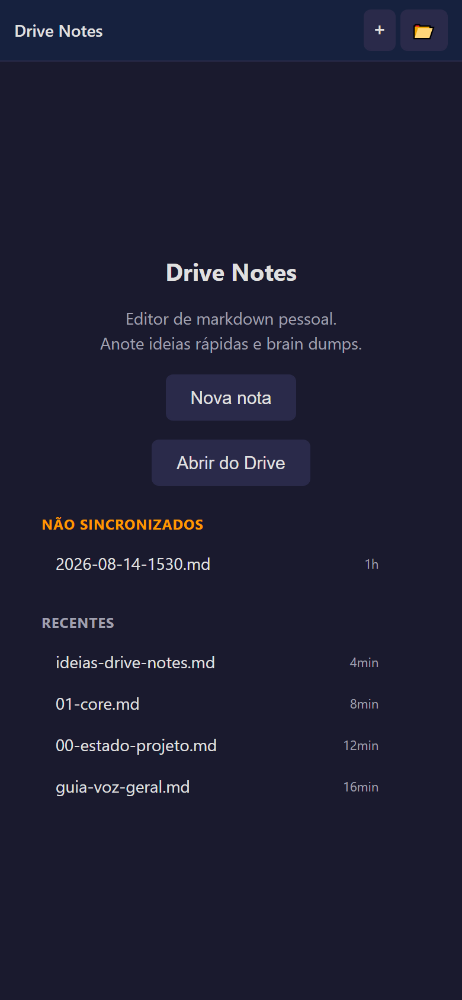
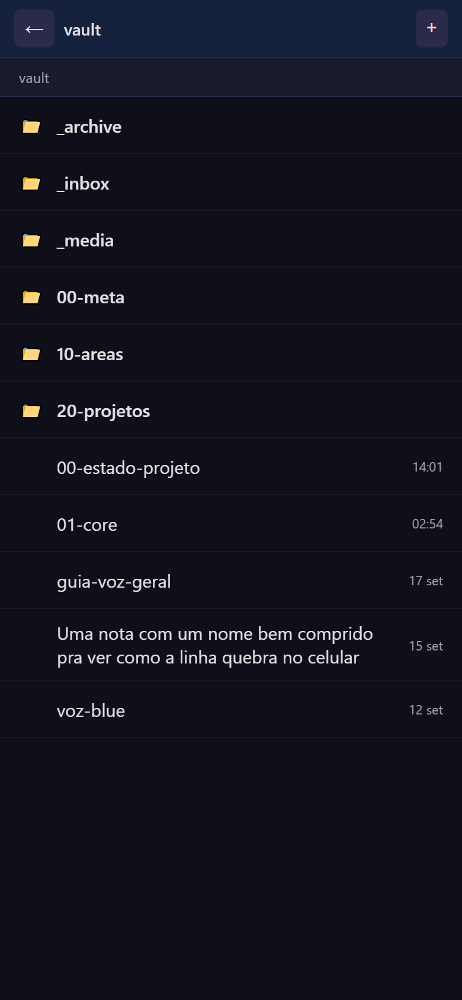
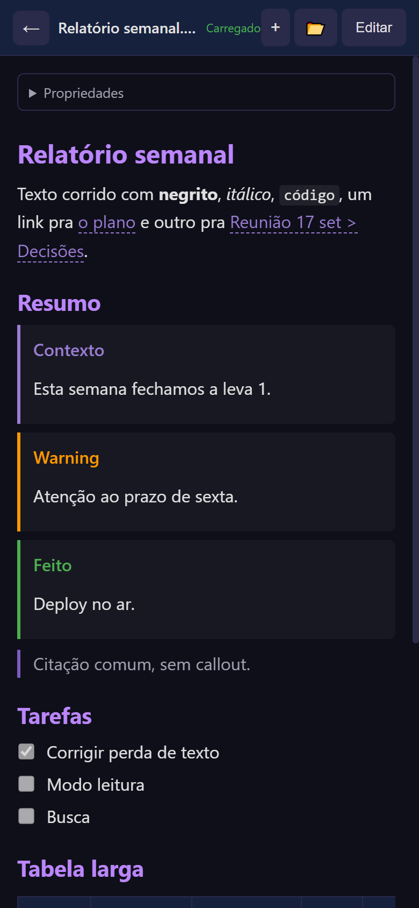

# Drive Notes

Um app de celular pra ler e editar notas em markdown direto no Google Drive. Sem app intermediário, sem exportar e importar, sem copiar e colar.

**App:** https://agathagio.github.io/drive-notes/

> O app é de uso pessoal e o login do Google está restrito à minha conta, então o link acima para na tela de login pra qualquer outra pessoa. Os prints abaixo mostram as telas com dados de exemplo. Pra ter o seu, veja [Rodar o seu](#rodar-o-seu).

## Por que existe

Minhas notas moram num vault do Obsidian dentro do Google Drive. No computador isso funciona bem. No celular, não existia um app que abrisse uma nota em markdown do Drive, mostrasse formatada e deixasse editar ali mesmo. O app do Drive só oferece download, e os editores de markdown querem as notas na nuvem deles.

Então fiz o meu. Hoje é por ele que eu leio e escrevo no vault quando estou longe do computador.

## Telas

  
  
  

## O que faz

**Ler**

- Nota do Drive abre formatada, em modo leitura. Um toque alterna pra edição.
- Entende o markdown do Obsidian: o frontmatter vira um bloco "Propriedades" recolhido, `[[wikilinks]]` abrem a nota certa (inclusive `[[nota#título]]`), callouts ganham cor por tipo, tabela larga rola de lado, imagem embutida (`![[foto.jpg]]`) aparece na nota.
- Navegador de pastas próprio, na mesma ordem do Obsidian (`2-x` antes de `10-x`), com a data da última edição.
- Busca na tela de pastas: o que se digita filtra a pasta aberta na hora, sem rede e sem ligar pra acento, e depois de uma pausa procura no vault inteiro, por nome e pelo texto das notas. Cada resultado mostra a pasta onde a nota mora.

**Escrever**

- Nota nova abre direto no editor, sem pedir nome antes. O nome sai do horário e o arquivo é criado no Drive em segundo plano.
- Datas no padrão do vault: nota nova nasce com `created` e `updated` nas propriedades, e salvar uma edição troca o `updated` pra data do dia. `created` nunca é inventado em nota antiga, e pastas como `_templates` e `_archive` ficam de fora.
- Barra de formatação fixa acima do teclado virtual, sem fechar o teclado a cada toque.
- Funciona com ditado por voz, e a página encolhe junto com o teclado pra ele não cobrir o texto.
- Foto direto na nota, com um botão pra câmera e outro pra galeria: a imagem é reduzida no aparelho, sobe pra pasta de anexos do vault e entra como `![[foto-...jpg]]`, do jeito que o Obsidian espera.
- Na edição o texto é markdown cru, mas a linha do `![[foto.jpg]]` mostra a imagem embaixo: dá pra escrever olhando pro que se está descrevendo.
- Renomear tocando no título.
- O gesto de voltar do Android fecha diálogo, sai da nota e volta de pasta, como em app nativo.

**Não perder texto**

Foi a parte que mais deu trabalho, e a que mais importa num app de notas.

- Tudo que é digitado vira rascunho no aparelho antes de ir pro Drive. Trocar de app, fechar a aba ou ficar sem sinal não perde nada.
- Antes de salvar, o app confere se o arquivo mudou no Drive desde que foi aberto (por exemplo, editado no computador). Se mudou, pergunta o que fazer: salvar a minha versão como cópia, sobrescrever, descartar a minha ou decidir depois.
- Toda escrita no Drive passa por uma fila única, pra criar e salvar ao mesmo tempo não duplicar arquivo.
- Login expirado no meio da escrita guarda o rascunho e avisa. Um toque em salvar renova o login e sincroniza.

## Como é feito

- **JavaScript puro, sem framework e sem build.** Quatro arquivos: `app.js`, `index.html`, `style.css` e `sw.js`. Push na `main` é deploy, via GitHub Pages.
- **PWA:** instala na tela inicial do celular, abre em tela cheia, e o service worker guarda o app e as bibliotecas pra abrir sem rede.
- **Google Drive API com OAuth** (Google Identity Services). Não tem servidor: o navegador fala direto com o Drive, e o token fica só no aparelho.
- **Bibliotecas, via CDN com versão fixa:** [TinyMDE](https://github.com/jefago/tiny-markdown-editor) no editor, [marked](https://github.com/markedjs/marked) pra renderizar e [DOMPurify](https://github.com/cure53/DOMPurify) pra sanitizar o HTML, já que o login dá acesso ao Drive inteiro.
- **Testes:** o `app.js` real roda no jsdom contra um Google Drive falso em memória (31 cenários, 228 checagens). O que o jsdom não enxerga (ditado por voz, o gesto de voltar, a barra de formatação no editor de verdade, a redução da foto) roda num Chrome ou Edge headless pelo protocolo de depuração. Um terceiro script tira os prints de todas as telas em tamanho de celular. Detalhes em [`tests/README.md`](tests/README.md).

Construído com IA: eu defino o problema, decido o comportamento e testo no aparelho; o código é escrito em sessões com o [Claude Code](https://claude.com/claude-code).

## Limites

- Feito pra uma pessoa só. Não tem conta, equipe nem compartilhamento.
- Offline é parcial: sem rede o app abre e dá pra escrever, e o texto fica guardado no aparelho até ser salvo no Drive. Abrir uma nota que já está no Drive precisa de internet.
- Renomear uma nota não atualiza os `[[links]]` que apontam pra ela.
- O gesto de voltar usa a API CloseWatcher, que hoje só existe em navegadores baseados no Chromium. Nos outros, o app cai pro histórico do navegador, que é menos confiável.

## Rodar o seu

O [`SETUP.md`](SETUP.md) tem o passo a passo: criar o projeto no Google Cloud, ativar a Drive API, gerar o Client ID, apontar o app pras suas pastas e publicar no GitHub Pages.

Pra rodar os testes: `npm install` uma vez, depois `npm test`.
